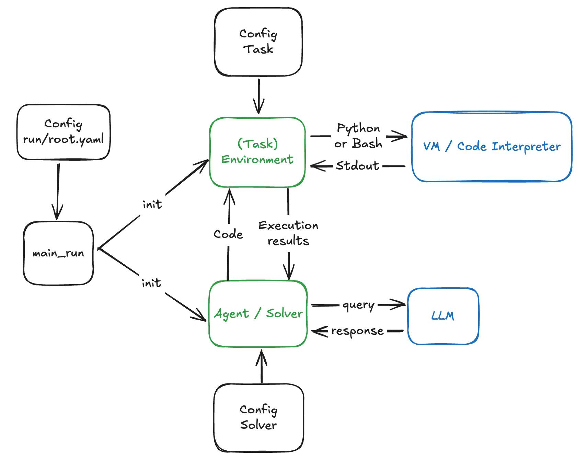

# `aira-dojo`: AI Research Agent DOJO 
<p align="center">
  <a href="https://creativecommons.org/licenses/by-nc/4.0/deed.en"></a>
  <a href="https://arxiv.org/abs/2507.02554">
  
  </a>
</p>

`aira-dojo` is a scalable and customizable framework for AI research agents, designed to accelerate hill-climbing on research capabilities toward a fully automated AI research scientist.
The framework provides a general abstraction for tasks and agents, implements the MLE-bench task, and includes the state-of-the-art agents introduced in our paper, “AI Research Agents for Machine Learning: Search, Exploration, and Generalization in MLE-bench.” Additionally, it features an isolated code execution environment that integrates smoothly with job schedulers like Slurm.
The framework enabled 1,000 agents to run in parallel for up to 120 hours, uncovering valuable insights and results detailed in the paper.

## 📚 Documentation

The following documentation is available to help you get started with `aira-dojo`:

- [Installation Guide](./docs/INSTALLATION.md) - Detailed setup instructions
- [Project Structure](./docs/PROJECT_STRUCTURE.md) - Overview of the codebase organization
- [Task Development Guide](./docs/TASK_DEVELOPMENT.md) - How to create new tasks
- [Solver Development Guide](./docs/SOLVER_DEVELOPMENT.md) - How to implement new solvers
- [Running Experiments](./docs/RUNNING_EXPERIMENTS.md) - How to run experiments with `aira-dojo`
- [Building Superimage](./docs/BUILD_SUPERIMAGE.md) - Instructions for building the superimage container

## Terminology

**Task**: A specific problem or challenge that the AI agent (solver) is designed to solve. Each task has a defined execution environment, solver action space, and evaluation function.

**Solver**: An AI agent that attempts to solve a given task. A solver is composed of:
- **Operators**: Functions that are used to generate new solutions (e.g., a call to an LLM with a specific prompt and some context).
- **Search Policy**: The method used to explore the solution space and orchestrate the execution of operators (e.g., greedy search, evolutionary search, Monte Carlo Tree Search)

**Run**: A single execution in which a **solver** (an AI agent) attempts to solve a given **task**.

**Runner**: A component used to parallelize runs. It manages and orchestrates multiple solver-task pairs concurrently, allowing large-scale experiments and rapid iteration across a portfolio of tasks and solvers.

The diagram below gives a high-level overview of the key components of the framework and how they interact.
<p align="center">
      <br/>
      
      <br/>
<p>

## Quick Start

### **1. Clone the Repository**
```bash
git clone https://github.com/facebookresearch/aira-dojo
cd aira-dojo
```

### **2. Create the conda environment**
```bash
conda env create -f environment.yaml
conda activate aira-dojo
```

### **3. Install aira-dojo via pip**
```bash
pip install -e .
```

### **4. Set up Environment Variables**
```bash
cp .env_default .env
# Edit .env with your specific configuration
```
Note that the `.env` file is ignored by git to avoid accidentally pushing tokens to github.

### **5. Change LLM Client Configs**
If you are using different endpoints, you should change them accordingly in `dojo/configs/run/solver/client`
Examples:
- **Changing Azure endpoint for 4o:**

  Go to [`src/dojo/configs/run/solver/client/litellm_4o.yaml`](./src/dojo/configs/solver/client/litellm_4o.yaml) and change the `base_url` to your Azure endpoint:
  ```yaml
    ...
    base_url: https://azure-services-endpoint-here.azure-api.net #<---- Set to your Azure endpoint
    ...
  ```
- **Changing to openai endpoint for 4o:**

  Go to [`src/dojo/configs/run/solver/client/litellm_4o.yaml`](./src/dojo/configs/solver/client/litellm_4o.yaml) and change the `base_url` and `use_azure_client` to the following:
  ```yaml
    ...
    base_url: null  # litellm will use the openai endpoint by default
    use_azure_client: False
    ...
  ```
  Finally, in `.env`, set your primary key to your openai key:
  ```yaml
  PRIMARY_KEY="sk-..." # <---- Set to your OpenAI key>
  ```

Note: To run the examples in the "Example Usage" section of this read me, you must setup the following models:
- `o3`: Set the `base_url` in [`src//dojo/configs/solver/client/litellm_o3.yaml`](./src//dojo/configs/solver/client/litellm_o3.yaml) and set the `PRIMARY_KEY_O3` in `.env`.
- `gpt-4o`: Set the `base_url` in [`src//dojo/configs/solver/client/litellm_4o.yaml`](./src/dojo/configs/solver/client/litellm_4o.yaml) and set the `PRIMARY_KEY` in `.env`.

### **6. Build a superimage with apptainer**
Follow the steps in [`docs/BUILD_SUPERIMAGE.md`](./docs/BUILD_SUPERIMAGE.md) to build your superimage. This is necessary to run tasks that use jupyter as the interpreter.

### **7. Install mle-bench and run you first task**
Follow the steps in [`src/dojo/tasks/mlebench/README.md`](./src/dojo/tasks/mlebench/README.md) to install mle-bench and run your first task.

### **8. Setting up wandb**
Log in with the following command:
```bash
  wandb login
```
It will ask you your API key, which you can get by going into "User settings" (click top right of screen) and scrolling down.

## Example Usage

### Single-Run Example
```bash
# Runs AIRA_GREEDY on a single MLE-bench task
python -m dojo.main_run +_exp=run_example logger.use_wandb=False
```

See the config [run_example.yaml](./src/dojo/configs/_exp/run_example.yaml) for details.

### Parallel-Run (Runner) Example
```bash
# Runs AIRA_GREEDY on our quick-dev set of MLE-bench tasks
python -m dojo.main_runner_job_array +_exp=runner_example logger.use_wandb=False launcher.debug=True
```

See the config [runner_example.yaml](./src/dojo/configs/_exp/runner_example.yaml) for details.

### Hydra Multi Parallel-Run Example
```bash
# Runs AIRA_GREEDY on our quick-dev set of MLE-bench tasks
python -m dojo.main_runner_job_array +_exp=runner_multi_example logger.use_wandb=False launcher.debug=True
```

See the config [runner_multi_example.yaml](./src/dojo/configs/_exp/runner_multi_example.yaml) for details.

### Running AIRA<sub>GREEDY</sub> , AIDE<sub>GREEDY</sub> , AIRA<sub>MCTS</sub> and AIRA_<sub>EVO</sub> on MLEbench lite

Note: Make you set `<<<DEFAULT_SLURM_ACCOUNT>>>`, `<<<DEFAULT_SLURM_QOS>>>`, and `<<<DEFAULT_SLURM_PARTITION>>>` with your actual Slurm account, QoS, and partition settings in your `.env` before running these commands

```bash
# Runs AIRA_GREEDY on MLE-bench lite tasks
python -m dojo.main_runner_job_array +_exp=mlebench/aide_greedy_o3 logger.use_wandb=False launcher.debug=False
# Runs AIDE_GREEDY on MLE-bench lite tasks
python -m dojo.main_runner_job_array +_exp=mlebench/aira_greedy_o3 logger.use_wandb=False launcher.debug=False

# Runs AIRA_MCTS on MLE-bench lite tasks
python -m dojo.main_runner_job_array +_exp=mlebench/aira_evo_o3 logger.use_wandb=False launcher.debug=False

# Runs AIRA_EVO on MLE-bench lite tasks
python -m dojo.main_runner_job_array +_exp=mlebench/aira_mcts_o3 logger.use_wandb=False launcher.debug=False
```

### Analyse and Visualize Results
To visualize results checkout [src/dojo/ui/README](./src/dojo/ui/README.md). To learn how to load and extract the best node of each experiment, checkout [notebooks/analyze_results.ipynb](./notebooks/analyze_results.ipynb).

## Citation

If you found this work useful, please consider citing:

```
@article{toledo2025airesearchagentsmachine,
    title={AI Research Agents for Machine Learning: Search, Exploration, and Generalization in MLE-bench}, 
    author={Edan Toledo and Karen Hambardzumyan and Martin Josifoski and Rishi Hazra and Nicolas Baldwin and Alexis Audran-Reiss and Michael Kuchnik and Despoina Magka and Minqi Jiang and Alisia Maria Lupidi and Andrei Lupu and Roberta Raileanu and Kelvin Niu and Tatiana Shavrina and Jean-Christophe Gagnon-Audet and Michael Shvartsman and Shagun Sodhani and Alexander H. Miller and Abhishek Charnalia and Derek Dunfield and Carole-Jean Wu and Pontus Stenetorp and Nicola Cancedda and Jakob Nicolaus Foerster and Yoram Bachrach},
    year={2025},
    journal={arXiv},
    url={https://arxiv.org/abs/2507.02554}
}
```

## License

This code is made available under a [CC BY-NC 4.0](https://creativecommons.org/licenses/by-nc/4.0/) license, as found in the [LICENSE](LICENSE) file. Some portions of the project are subject to separate license terms outlined in [THIRD_PARTY_LICENSES.md](THIRD_PARTY_LICENSES.md).
